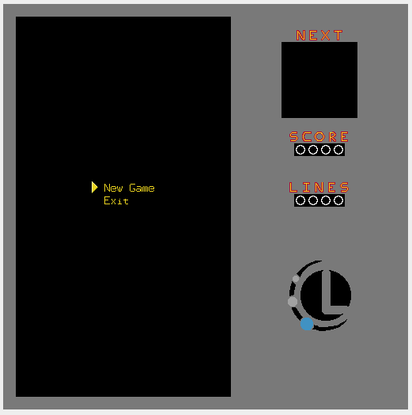
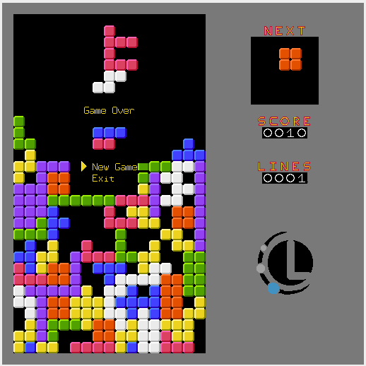
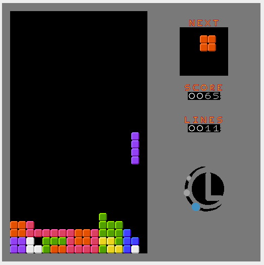

# Tetris-MIPS
It's the game tetris created using the MARS, MIPS Simulator, assembly languge.

## Run the Game

- Load the [Main.asm](Main.asm) file;
- Open and connect the Keyboard and Display MMIO Simulator;
- Open and connect the Bitmap Display with a 512x512 size and starting address at $gp;
- Build and run the game (the code use lots of macros, so this may take some time);

## Commands

Arrows and Enter can handle pretty much everything

## Screeshots

## Authros

[Jonathas Conceição](https://github.com/Jonathas-Conceicao)  
[Lucas Bretana](https://github.com/lucasbretana)
